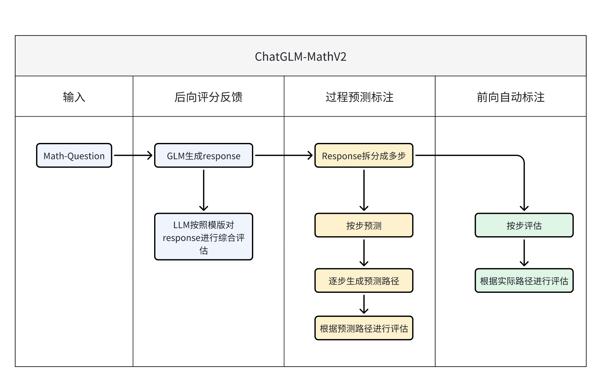

PRM help llm math

> 大模型在求解数学问题时，给出的回答通常存在各种计算或推理错误。
>
> 为了进一步提升大模型求解数学问题的准确性和鲁棒性，本项目通过详尽的pipeline设计，完成了针对大模型数学能力提升用数据集的自动化制备流程。

整体pipeline如下图：



请根据您使用和引用的内容考虑引用以下内容：

- 代码： alpaca_eval（本软件仓库）。

以下是 bibtex 条目：

```
@misc{du2024chatglmmathv2,
  author = {Jinhua Du and Zhenyu Hou},
  title = {ChatGLM-MathV2: Forward automatic labeling combined with backward scoring feedback for computational process rewarding},
  year = {2024},
  publisher = {GitHub},
  journal = {GitHub repository},
  howpublished = {\url{https://github.com/dujh22/ChatGLM-MathV2}}
}
```
