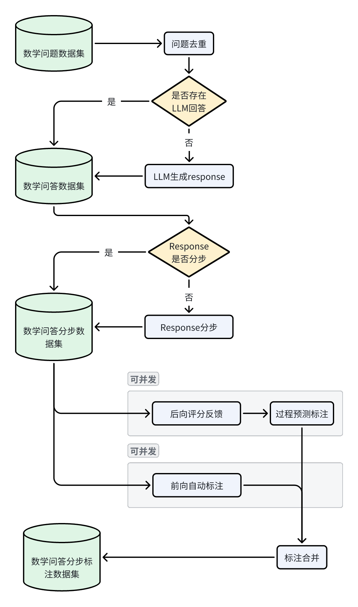

# ChatGLM-MathV2：前向自动标注与后向评分反馈结合进行计算过程奖励

大模型在求解数学问题时，给出的回答通常存在各种计算或推理错误。

为了进一步提升大模型求解数学问题的准确性和鲁棒性，本项目通过详尽的pipeline设计，完成了针对大模型数学能力提升用数据集的自动化制备流程。

整体pipeline如下图：



具体包括三个部分：分别是模型后向评分反馈、模型过程预测标注 和 模型前向自动标注。

其中：

模型后向评分反馈的核心是直接将llm对question的response与reference-answer进行比较评分，是一个粗粒度相对宽松评分；

模型过程预测标注是针对llm对question的response，分步扩展并利用扩展路径进行预测评分，是一个细粒度相对宽松评分；

模型前向自动标注是针对llm对question的response，分步逐步利用tool（计算tool和推理tool）进行实际评分，是一个细粒度相对严格评分。

详细pipeline见下图：


## 1. 项目配置

1. 本项目对python环境无严格的版本要求，采用常用的环境即可
2. 进行必要包安装

   ```
   pip install -r requirements.txt
   ```
3. 请将数据集下载放到raw_data文件夹下，下载数据可使用utils/data_download.py+data_urls.txt(注意多次执行直到命令行全部输出√)；也可以直接copy到该目录下
4. 请配置自己的config.py文件，并放到llm文件夹下，具体格式为（也可不配置，视具体情况而定）

```
# GPT API密钥和基本URL
GPT_API_KEY = "sk-***9"
GPT_BASE_URL = "https://**"

# GLM API密钥和基本URL
GLM_API_KEY = "***"
GLM_BASE_URL = "https://***"

# 用于答案补全的配置参数
TGI_URL = "http://***"

# 用于答案评分的配置参数
CRITIC_URL = "http://***"
```

## 2. 使用说明

### 2.1 最简单的使用方式：调用api串行执行

> 推荐使用2.4，本小节代码未及时和2.4逻辑同步，运行中可能由于版本问题兼容性存在问题

不需要考虑其他事情，只需要简单地运行：

```shell
python api_both.py
```

#### 2.1.1 需要关注的文件

| 文件名称    | 文件说明                                  | 进一步说明 |
| ----------- | ----------------------------------------- | ---------- |
| api_both.py | 这是核心文件，可模仿main函数完成api的调用 | 见下       |
| config.py   | 记录了LLM的API密钥和基本URL               |            |
| chatglm.py  | chatglm调用文件                           |            |

注意需要设置相应的环境变量：共有两个部分。

1. 最开头这两行用于命令行测试，一般不需要打开，如果需要查看api执行过程的详细信息，则打开这两行

   ```python
   import hunter # 用于调试
   hunter.trace(module=__name__) # 用于调试
   ```
2. 设置调用LLM的相关信息。请根据具体情况进行调整，注意llm_response函数名和传入参数、返回值不可更改，否则影响api.py运行

   ```python
   # 该部分用于设置调用的LLM相关信息
   import config # 记录了密钥等实际值
   import openai
   # 设定API密钥和基本URL
   openai.api_key = config.GPT_API_KEY
   openai.api_base = config.GPT_BASE_URL
   from chatglm import ChatGLM
   ChatGLM = ChatGLM()
   USE_GLM_OR_GPT = 'glm'
   # 这里设置使用的llm进行生成，注意在本项目中只有这里一个地方进行相关设置
   def llm_response(prompt, use_glm_or_gpt = USE_GLM_OR_GPT):
       response = "ERROR for LLM"
       for i in range(10):
           if use_glm_or_gpt == 'glm':
               try:
                   response = ChatGLM.generate(prompt)
                   return response
               except:
                   continue
           else:
               try:
                   # 构造messages
                   messages = [{"role": "user", "content": prompt}]
                   # 调用GPT接口
                   # model = "gpt-3.5-turbo"
                   model = "gpt-4-1106-preview"
                   chat_completion = openai.ChatCompletion.create(model=model, messages = messages)
                   response = chat_completion.choices[0].message.content
                   return response
               except:
                   continue
       return response
   ```

在api_both.py的核心函数api中，有一部分可以自适应打开关闭：【可选】

```
def api_both(question, response = None, answer = None):
    ……

    # 如果全量输出，则关闭下面一行，否则只输出必要信息【可选】
    # out_data = postprocess(data4)

    # 如果有到导出文件的必要，可打开下面一行【可选】
    out_to_file(out_data)

    # 返回处理后的数据
    return out_data
```

#### 2.1.2 字段说明

##### 传入字段

```json
{
    "question":"问题", # 一个英文字符串
    "response":"针对问题LLM的响应", # 一个英文字符串（可选）
    "answer":"针对问题的参考答案" # 一个英文字符串（可选）
}
```

##### 主要传出字段

以json格式输出，其中：

1. `question`：包含具体问题的文本。这通常是用户提出的一个具体的查询或任务，这里以数学问题为主。
2. `response`：对问题LLM的详细回答。这个回答包含了解决问题的步骤、计算和推理过程。
3. `answer`：问题的参考答案。在这个上下文中，可能是空的，表示没有单独的参考答案提供。
4. `critic_result`：这是一个数组，包含对响应的评价和分析。

   - `response`：重复问题的回答。
   - `rating`：给回答的评分，通常是一个数字。
   - `judge_result`：评价回答的文本，详细说明了为何给出该评分。
5. `generated_paths`：这是一个数组，展示了生成答案的不同可能的路径或方法。

   - `step`：描述生成步骤的文本。
   - `extension`：该步骤的不同扩展路径实现方式或详细解释。
   - `ratings`：对每个扩展给出的评分。
   - `soft_label`：软标签，通常用于表示分类的不确定性。
   - `hard_label`：硬标签，通常是一个确定的分类标签。
6. `critic_scores`：总结了批评结果的评分。

   - `ratings`：所有评分的列表。
   - `avg_score`：平均评分。
   - `pass_rate`：通过率，表示有多少比例的评分是积极的。
7. `solution`：这是一个对象，详细描述了解决问题的每个步骤。

   - `Step 1`，`Step 2`等：每个步骤的详细信息，包括内容描述、是否涉及计算或推理、相关的数学方程等。
   - `content`：步骤的描述。
   - `label`：步骤的分类标签。
   - `is_calculation_or_reasoning`：表示步骤是否涉及计算或推理。
   - `equation`：步骤中使用的数学方程。
   - `leftSideOfEqualSign`和 `rightSideOfEqualSign`：方程等号左边和右边的计算过程。
   - `history_json`：记录了到达当前步骤的历史路径。
   - 其他更细粒度的标签，参照 [ChatGLM-MathV2：AutomatedLabeling自动化逐步标注人类反馈](./README2.md)

这些键合起来构成了一个结构化的方式来描述和评估一个问题的解决方案及其有效性。

### 2.2 模块化使用

如果针对当前提供的三个模块（模型后向评分反馈、模型过程预测标注 和 模型前向自动标注）希望单独使用或者独立组合使用，请关注这一部分。

我们首先对本项目涉及到的三个模块进行细粒度说明：


针对 模型后向评分反馈、模型过程预测标注，请跳转至  [math-feedback数学反馈](./shepherd_prm/readme.md)

针对 模型前向自动标注，请跳转至  [ChatGLM-MathV2：AutomatedLabeling自动化逐步标注人类反馈](./README2.md)

#### 2.2.1 需要关注的文件

> 推荐使用2.4，本小节代码未及时和2.4逻辑同步，运行中可能由于版本问题兼容性存在问题

| 文件名称     | 文件说明                                            | 进一步说明                                                           |
| ------------ | --------------------------------------------------- | -------------------------------------------------------------------- |
| api_front.py | 这是模型后向评分反馈、模型过程预测标注模块的api实现 | [math-feedback数学反馈](./shepherd_prm/readme.md)                       |
| api.py       | 这是模型前向自动标注模块的api实现                   | [ChatGLM-MathV2：AutomatedLabeling自动化逐步标注人类反馈](./README2.md) |

### 2.3 可debug的一般使用方式：结合本地文件系统调用api

> 推荐使用2.4，本小节代码未及时和2.4逻辑同步，运行中可能由于版本问题兼容性存在问题

如果希望对中间过程进行输出，并进行全面跟踪，推荐这种方式

```shell
python pipeline_function_both.py
```

#### 2.2.1 需要关注的文件

| 文件名称                  | 文件说明                                                                            |
| ------------------------- | ----------------------------------------------------------------------------------- |
| pipeline_function_both.py | 这是包含三个模块pipeline的核心文件，main函数中可选择采用api还是pipeline的形式       |
| pipeline_function.py      | 这是只包含前向自动标注pipeline的核心文件，main函数中可选择采用api还是pipeline的形式 |

这里pipeline_function.py的具体说明详见  [ChatGLM-MathV2：AutomatedLabeling自动化逐步标注人类反馈](./README2.md)，这里针对pipeline_function_both.py做进一步的说明：

```python
def pipeline_file():
    ……
    prompt_template_path = 'F://code//github//ChatGLM-MathV2//shepherd_prm//templates//criticllm_math_template.txt' # 这里用于设置结果评估prompt所在的路径
    ……
    input_file_path = "F://code//github//ChatGLM-MathV2//data//test_data//test_data0.jsonl" # 这里用于设置最开始处理的文件路径
    ……
    # step 5：前向实际路径自动标注
    is_test = True # 小样本开关：如果为True，则只处理少量数据，如果为False，则处理全量数据
```

### 2.4 并发执行文件批处理

如果是针对多条数据，建议采用批处理方式，本项目对批处理进行了有效支持。


为了方便用户一步调用完整pipeline，可以windows系统下直接采用如下命令

```
.\pipeline.bat
```

Linux直接采用如下命令

```shell
sudo chmod +x pipeline_linux.sh
./pipeline_linux.sh
```

Max直接采用如下命令

```
sudo chmod +x pipeline_mac.sh
./pipeline_mac.sh
```

如果有问题可做如下调整，在shepherd_prm/query_api.py中：

```python
# task_queue,done_queueQueue(maxsize=QUEUE_SIZE),Queue(maxsize=QUEUE_SIZE)
task_queue,done_queue Queue(),Queue()
```


这个批处理脚本涵盖了数据预处理、API查询、数据评分、路径预测、准确性计算和自动标记等多个阶段。

注意在运行上述命令前，其中的参数可以进一步根据实际需要调整设置，相关进一步参数用途可参照下面的具体运行过程。

【也可以注意到存在一个不可运行的样例pipeline_zh.bat，里面进行了相关注释！！】

一般来说，只需要修改如下参数

| 序号 | 变量名               | 说明                                                                                                                                                                                                                                                              | 示例                                                                                                                                                 |
| ---- | -------------------- | ----------------------------------------------------------------------------------------------------------------------------------------------------------------------------------------------------------------------------------------------------------------- | ---------------------------------------------------------------------------------------------------------------------------------------------------- |
| 1    | project_path         | 设置项目路径变量                                                                                                                                                                                                                                                  | F://code//github//ChatGLM-MathV2//                                                                                                                   |
| 2    | num_parallel_process | 设置并行处理过程的数量，越大pipeline运行越快                                                                                                                                                                                                                      | 10                                                                                                                                                   |
| 3    | dataset              | 设置数据集名称变量，这一步是必须的，因为如果给定的数据集名称不在pipeline可处理数据集中，需要再新增预处理函数，具体参见utils/data_preprocessing.py逻辑，请将新数据集格式归一化到类似math_shepherd经过data_preprocessing.py处理后的格式，否则会严重影响后续pipeline | math_shepherd                                                                                                                                        |
|      | has_label            | 设置是否有标签的变量，标识这个数据集的每个问题的每个step有没有reference_correct_label，取值只有hasnot/hasset                                                                                                                                                      | hasnot                                                                                                                                               |
|      | has_response         | 设置是否有响应的变量，标识这个数据集的每个问题是否已经存在response，如果不存在会重新生成，取值只有has/hasnot                                                                                                                                                      | hasnot                                                                                                                                               |
|      | input_file_path      | 设置输入原始数据集文件路径                                                                                                                                                                                                                                        | %project_path%raw_data//peiyi9979_Math_Shepherd//math-shepherd.jsonl                                                                                 |
|      | num_points           | 设置待处理的数据数量，比如处理前100条                                                                                                                                                                                                                             | 100                                                                                                                                                  |
|      | 其他参数             | 不建议修改，如确有必要                                                                                                                                                                                                                                            | 比如backbone是选择的llm类型，现在支持的是tgi和chatglm_platform，其中tgi可用与generate，也可用于critic（注意url应该不同），chatglm_platform用于critic |

每一次生成完成后，在data文件夹下可以找到对应的结果文件，其中：

front_Check2Step4子文件夹下的jsonl是最终的标注文件

front_Check2Step4子文件夹下的_ConfusionMatrix.csv是混淆矩阵结果

front_Check2Step4子文件夹下的_statistic.csv是acc前向详细结果

tgi_math_critic_path_math_critic2_statistics2.csv是acc后向详细结果（注意statistics2.csv和statistics.csv可能结果存在不同，应以2为准）

在front_step*子文件夹中都同时有一个jsonl和csv文件，csv文件用于可视化debug

#### 2.4.0 数据预处理

主要采用utils中的三个文件，分别是：

1. get_data_for_codeTest.py：用户从大数据中获得小批量数据
2. make_test_data.py：用于从math_shepherd数据集转化获得原始测试数据集
3. judge_data_duplicates_and_languageStats.py：用于对原始测试数据集查重并分析语言

建议采用集合脚本直接一步到位，获得指定数量的，无重，单语或双语数据集

> cd ./utils
>
> python  data_preprocessing.py

#### 2.4.1 后向生成结果

> shepherd_prm/query_api.py

首先修改相关参数：在main函数中

```python
code_test = True

backbone = "tgi" # generate用tgi，critic用chatglm_platform
input_file_path = "F://code//github//ChatGLM-MathV2//data//test_data100//test_data100.jsonl" # 这个是原始文件所在位置
mode = "response"
# backbone = "chatglm_platform"
# input_file_path = "F://code//github//ChatGLM-MathV2//data//test_data100//test_data100_tgi.jsonl"
# mode = "critic"
```

然后运行

```shell
cd ./shepherd_prm
python query_api.py
```

#### 2.4.2 后向结果评分反馈

> shepherd_prm/query_api.py

首先修改相关参数：在main函数中

```python
# backbone = "tgi" 
# input_file_path = "F://code//github//ChatGLM-MathV2//data//test_data100//test_data100_tgi.jsonl" # 注意修改，是2.4.1的_tgi
# mode = "response"
backbone = "chatglm_platform"
input_file_path = "F://code//github//ChatGLM-MathV2//data//test_data100//test_data100_tgi.jsonl"
mode = "critic"
```

然后运行

```shell
python query_api.py
```

#### 2.4.3 前向过程路径预测

> shepherd_prm/prm_evaluate_process.py

首先修改相关参数：在main函数中

```python
code_test = True

backbone = "tgi" 
input_file_path = "F://code//github//ChatGLM-MathV2//data//test_data100//test_data100_tgi_math_critic.jsonl" # 注意修改，是2.4.2的_math_critic
mode = "generation"
# backbone = "chatglm_platform"
# input_file_path = "F://code//github//ChatGLM-MathV2//data//test_data100//test_data100_tgi_math_critic_path.jsonl"
# mode = "critic"
```

然后运行

```shell
python prm_evaluate_process.py
```

#### 2.4.4 前向过程路径评估与评估结果汇总

> shepherd_prm/api_front_time.py

首先修改相关参数：在main函数中

```python
# backbone = "tgi" 
# input_file_path = "F://code//github//ChatGLM-MathV2//data//test_data100//test_data100_tgi_math_critic.jsonl" 
# mode = "generation"
backbone = "chatglm_platform"
input_file_path = "F://code//github//ChatGLM-MathV2//data//test_data100//test_data100_tgi_math_critic_path.jsonl" # 注意修改，是2.4.3的_path
mode = "critic"
```

然后运行

```shell
python prm_evaluate_process.py
```

最终2.4.1-2.4.4的运行结果在 F://code//github//ChatGLM-MathV2//data//test_data100//test_data100_tgi_math_critic_path_math_critic2.jsonl

针对2.4.1-2.4.4的评估Acc,需要在上面的指令完成后，手动运行如下指令：

```shell
python Check3_CalculatePathPredictAccuracy.py
```

同样注意首先修改一下相关参数：在main函数中

```python
file_path = 'F://code//github//ChatGLM-MathV2//data//test_data100//test_data100_tgi_math_critic_path_math_critic2.jsonl'
output_file_path = 'F://code//github//ChatGLM-MathV2//data//test_data100//test_data100_tgi_math_critic_path_math_critic2_statistics.csv'
```

还需注意的是，如果2.4.4输出文件中，不包括可以对比的答案信息，需要执行如下脚本将答案信息插入其中再计算Acc，否则Acc默认全部与label=None进行比较。

#### 2.4.5 前向自动标注

##### 2.4.5.1 基本数据集获取

> utils\turn_response_and_solution.py

首先修改相关参数，在main函数中

```python
input_file_path = 'F://code//github//ChatGLM-MathV2//data//test_data100//test_data100_tgi.jsonl'
output_file_path = 'F://code//github//ChatGLM-MathV2//data//test_data100//front//test_data100.jsonl'
```

然后运行

```shell
cd ./utils
python turn_response_and_solution.py
```

##### 2.4.5.2 数据分步

> Step1_SplitByRow.py

首先修改相关参数，在main函数中

```python
source_folder = 'F://code//github//ChatGLM-MathV2//data//test_data100//front'
target_folder = 'F://code//github//ChatGLM-MathV2//data//test_data100//front_step1'
```

然后运行

```shell
cd ..
python Step1_SplitByRow.py
```

##### 2.4.5.3 步骤类型判断

> Step2_IsCalculationOrReasoning.py

首先修改相关参数，在main函数中

```python
source_folder = 'F://code//github//ChatGLM-MathV2//data//test_data100//front_step1'
target_folder = 'F://code//github//ChatGLM-MathV2//data//test_data100//front_step2'
```

然后运行

```shell
python Step2_IsCalculationOrReasoning.py
```

##### 2.4.5.4 计算步细标注

> Step3_JudgmentStepCalculatedCorrectly.py

首先修改相关参数，在main函数中

```python
source_folder = 'F://code//github//ChatGLM-MathV2//data//test_data100//front_step2'
target_folder = 'F://code//github//ChatGLM-MathV2//data//test_data100//front_step3'  
```

然后运行

```shell
python Step3_JudgmentStepCalculatedCorrectly.py
```

如果过程中出现错误，可以反复运行上述指令。代码的鲁棒性保证会从断电数据出发继续进行执行。

该脚本会自动调用Check1_JsonVisualization.py，最终会在输出目录下除输出结果jsonl文件的同时输出一个对应的分步scv文件用于可视化debug。

##### 2.4.5.5 推理步细标注

> Step4_JudgmentStepReasoningCorrectly.py

首先修改相关参数，在main函数中

```python
source_folder = 'F://code//github//ChatGLM-MathV2//data//test_data100//front_step3'
target_folder = 'F://code//github//ChatGLM-MathV2//data//test_data100//front_step4'
```

然后运行

```shell
python Step4_JudgmentStepReasoningCorrectly.py
```

如果过程中出现错误，可以反复运行上述指令。代码的鲁棒性保证会从断电数据出发继续进行执行。

该脚本会自动调用Check1_JsonVisualization.py，最终会在输出目录下除输出结果jsonl文件的同时输出一个对应的分步scv文件用于可视化debug。

该脚本会自动调用Check2_CalculateAccuracy.py，最终会在_Check2Step4结尾的输出目录下输出进一步包含评估的结果jsonl文件，同时输出csv文件记录的详细Acc。

#### 2.4.6 数据后处理

> 目前2.4.6已经被合并到2.4.1-2.4.5内，无需进行额外的后处理

在2.4.4和2.4.5结束后，会分别得到两个jsonl文件，在最后有比较进行文件的合并。

这里合并前首先要保证两种是可合并的，所以要进行文件分析，可以采用utils/jsonl_difference_find.py进行；然后再针对同一Question的前向和后向标注进行合并。

为了方便执行，我们将这些步骤封装在一个脚本中，可以直接运行，注意修改相关参数，在main函数中

```shell
file_path1 = "F://code//github//ChatGLM-MathV2//data//test_data100//test_data100_tgi_math_critic_path_math_critic2.jsonl"
file_path2 = "F://code//github//ChatGLM-MathV2//data//test_data100//front_Check2Step4//test_data100.jsonl"
output_file_path = "F://code//github//ChatGLM-MathV2//data//test_data100//pipeline_merge//test_data100.jsonl"
```

然后运行

```shell
python jsonl_file_merge.py
```

#### 2.4.7 计算指标

通过对输出结果的最终统计，计算混淆矩阵，包括准确率、精确率和召回率等
为了方便执行，我们将这些步骤封装在一个脚本中，可以直接运行，注意修改相关参数，在main函数中

```shell
file_path = 'F://code//github//ChatGLM-MathV2//data//math_shepherd_test_data10//front_Check2Step4//math_shepherd_test_data10.jsonl'
output_file_path = 'F://code//github//ChatGLM-MathV2//data//math_shepherd_test_data10//front_Check2Step4//math_shepherd_test_data10_ConfusionMatrix.csv'
```

然后运行

```shell
python Check4_CalculateConfusionMatrix.py
```

## 3. 辅助函数说明

主要分步在几个子文件内：

### 3.1 utils

该文件夹内是一些工具性质的脚本：

1. get_data_for_codeTest.py：用户从大数据中获得小批量数据
2. make_test_data.py：用于从math_shepherd数据集转化获得原始测试数据集
3. path_conversion.py：用于路径转换
4. pipelineForDataAnnotation.py：用于针对中文数据集进行response分步和步规约（如果超过10步规约回10步内）
5. judge_data_duplicates_and_languageStats.py：处理文件夹中的所有jsonl文件，查重并分析语言
6. math_chatglm_raw_data_standard.py：math_chatglm_raw_data数据集标准化
7. run_python_func.py：用于自动化执行python脚本
8. data_download.py：用于huggingface数据集下载
9. jsonl_difference_find：用于判断两种标注方式获得的数据集是否存在不同的（无法合并的）标志位，针对存在的不同会输出csv文件

### 3.2 llm

该文件夹内是一些大模型接口调用相关的脚本

## 4. 引用

请根据您使用和引用的内容考虑引用以下内容：

- 代码： alpaca_eval（本软件仓库）。

以下是 bibtex 条目：

```
@misc{du2024chatglmmathv2,
  author = {Jinhua Du and Zhenyu Hou},
  title = {ChatGLM-MathV2: Forward automatic labeling combined with backward scoring feedback for computational process rewarding},
  year = {2024},
  publisher = {GitHub},
  journal = {GitHub repository},
  howpublished = {\url{https://github.com/dujh22/ChatGLM-MathV2}}
}
```
