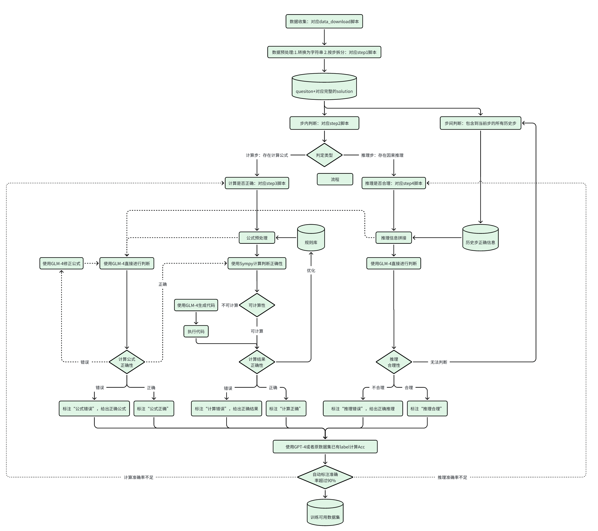

# ChatGLM-MathV2：AutomatedLabeling自动化逐步标注人类反馈

大模型在求解数学问题时，给出的回答中一般存在两种潜在的错误类型：计算错误 或者 推理错误。其中计算错误又可细分为计算结果错误 和 计算公式错误。这给用于训练大模型数学能力的数据集构造带来了极大的人工成本。

为了解决这一问题，本项目通过详尽的pipeline设计，完成了针对大模型用数据集的自动化逐步标注人类反馈，具体从可行性、完善性、容错性和可迁移性角度进行多次迭代，已经能较好完成人类反馈的去人工自动化标注。

详细pipeline见下图：



## 1. 项目配置

1. 本项目对python环境无严格的版本要求，采用常用的环境即可

2. 进行必要包安装

   ```
   pip install -r requirements.txt
   ```

## 2. 使用说明

### 2.1 最简单的使用方式：调用api

不需要考虑其他事情，只需要简单地运行：

```shell
python api.py
```

#### 2.1.1 需要关注的文件

| 文件名称   | 文件说明                                  | 进一步说明 |
| ---------- | ----------------------------------------- | ---------- |
| api.py     | 这是核心文件，可模仿main函数完成api的调用 | 见下       |
| config.py  | 记录了LLM的API密钥和基本URL               |            |
| chatglm.py | chatglm调用文件                           |            |

注意需要设置相应的环境变量：共有两个部分。

1. 最开头这两行用于命令行测试，一般不需要打开，如果需要查看api执行过程的详细信息，则打开这两行

   ```python
   import hunter # 用于调试
   hunter.trace(module=__name__) # 用于调试
   ```

2. 设置调用LLM的相关信息。请根据具体情况进行调整，注意llm_response函数名和传入参数、返回值不可更改，否则影响api.py运行

   ```python
   # 该部分用于设置调用的LLM相关信息
   import config # 记录了密钥等实际值
   import openai
   # 设定API密钥和基本URL
   openai.api_key = config.GPT_API_KEY
   openai.api_base = config.GPT_BASE_URL
   from chatglm import ChatGLM
   ChatGLM = ChatGLM()
   USE_GLM_OR_GPT = 'glm'
   # 这里设置使用的llm进行生成，注意在本项目中只有这里一个地方进行相关设置
   def llm_response(prompt, use_glm_or_gpt = USE_GLM_OR_GPT):
       response = "ERROR for LLM"
       for i in range(10):
           if use_glm_or_gpt == 'glm':
               try:
                   response = ChatGLM.generate(prompt)
                   return response
               except:
                   continue
           else:
               try:
                   # 构造messages
                   messages = [{"role": "user", "content": prompt}]
                   # 调用GPT接口
                   # model = "gpt-3.5-turbo"
                   model = "gpt-4-1106-preview"
                   chat_completion = openai.ChatCompletion.create(model=model, messages = messages)
                   response = chat_completion.choices[0].message.content
                   return response
               except:
                   continue
       return response
   ```

在api.py的核心函数api中，有一部分可以自适应打开关闭：【可选】

```
def api(question, solution):
    data = {"question": question, "solution": solution}
    data1 = SplitByRow(data) # 数据分行与公式高亮
    data2 = IsCalculationOrReasoning(data1) # 判断计算步还是推理步
    data3 = JudgmentStepCalculatedCorrectly(data2) # 针对计算步的自动标注
    data4 = JudgmentStepReasoningCorrectly(data3) # 针对推理步的自动标注
    out_data = data4

    # 如果全量输出，则关闭下面一行，否则只输出必要信息【可选】
    out_data = postprocess(data4)

    # 如果有到导出文件的必要，可打开下面一行【可选】
    out_to_file(out_data)

    # 返回处理后的数据
    return json.dumps(out_data, ensure_ascii=False)
```

#### 2.1.2 字段说明

##### 传入字段

```json
{
    "question":"问题", # 一个英文字符串
    "solution":"求解步骤", # 一个英文字符串
}
```

##### 主要传出字段（这里以两部可解问题为例）

当api.py中函数api里out_data = postprocess(data4)被打开时

```json
{
  "question": "问题描述：提出的问题，需要解决的问题内容。",
  "solution": {
    "Step 1": {
      "content": "步骤内容：对此步骤的描述。",
      "is_calculation_or_reasoning": "指示该步骤是否涉及计算或逻辑推理（1表示涉及计算，0表示涉及推理）。",
      "JudgmentStepCalculatedCorrectly": "判断此步骤计算结果是否正确的数组（0代表错误，1代表正确）。",
      "JudgmentStepEquationCorrectly": "判断此步骤计算公式是否正确的数组（0代表错误，1代表正确）。",
      "JudgmentStepReasoningCorrectly": "判断此步骤推理是否正确的数值（0代表错误，1代表正确）。",
      "StepCalculatedCorrectlyResult": "此步骤计算正确的结果。",
      "StepEquationCorrectlyFormat": "此步骤公式正确的格式。",
      "StepReasoningCorrectlyResult": "此步骤推理正确的结果。"
    },
    "Step 2": {
      "content": "步骤内容：对此步骤的描述。",
      "is_calculation_or_reasoning": "指示该步骤是否涉及计算或逻辑推理。",
      "JudgmentStepCalculatedCorrectly": "判断此步骤计算结果是否正确的数组。",
      "JudgmentStepEquationCorrectly": "判断此步骤计算公式是否正确的数组。",
      "JudgmentStepReasoningCorrectly": "判断此步骤推理是否正确的数值。",
      "StepCalculatedCorrectlyResult": "此步骤计算正确的结果。",
      "StepEquationCorrectlyFormat": "此步骤公式正确的格式。",
      "StepReasoningCorrectlyResult": "此步骤推理正确的结果。"
    }
  },
  "modifiedResult": {
    "Step 1": "修改后的步骤内容：对步骤1的修正描述。",
    "Step 2": "修改后的步骤内容：对步骤2的修正描述。"
  }
}
```

* 这里计算结果和计算公式部分之所以是数组，因为一个step中可能存在多个计算公式与对应结果，这里api按顺序依次给出了标签

##### 附加传出字段

当api.py中函数api里out_data = postprocess(data4)被关闭时，输出的json对象会更复杂，包括：

- **question**: 描述了问题的具体内容。
- **solution**: 包含了解决问题的各个步骤，每个步骤都是一个对象，包含以下字段：
  - **content**: 描述了该步骤的具体操作内容。
  - **label**: 人工或者参考标记步骤是否正确（1表示正确）。
  - **is_calculation_or_reasoning**: 指示该步骤是否涉及计算或逻辑推理（1表示涉及）。
  - **equation**: 包含了该步骤中使用的数学表达式。
  - **leftSideOfEqualSign**: 表达式等号左边的内容进行简化和计算的详细过程。
  - **rightSideOfEqualSign**: 表达式等号右边的内容进行简化和计算的详细过程。
  - **leftSideOfEqual_use_sympy_or_llm**: 指示等号左侧表达式是否使用了 `sympy`（一种数学表达式处理库）或其他方法进行处理。
  - **rightSideOfEqual_use_sympy_or_llm**: 指示等号右侧表达式是否使用了 `sympy` 或其他方法进行处理。
  - **leftSideOfEqual_code**: 如果使用编程代码处理等号左侧表达式，这里会包含相关代码。
  - **rightSideOfEqual_code**: 如果使用编程代码处理等号右侧表达式，这里会包含相关代码。
  - **JudgmentStepCalculatedCorrectly**: 数组，判断该步骤的计算是否正确（0表示错误，1表示正确）。
  - **StepCalculatedCorrectlyResult**: 包含该步骤正确计算的结果。
  - **JudgmentStepEquationCorrectly**: 数组，判断该步骤的计算公式是否正确设置（0表示错误，1表示正确）。
  - **StepEquationCorrectlyFormat**: 包含该步骤计算公式正确的格式。
  - **StepEquationCorrectlyFormatLLMResponse**: 包含对计算公式格式正确性的语言模型回应。
  - **history_json**: 存储前面步骤的历史记录，便于回溯分析。（这里会对之前的历史步骤按照之前的标签和信息进行正确修正）
  - **JudgmentStepReasoningCorrectly**: 判断该步骤的逻辑推理是否正确（0表示错误，1表示正确）。
  - **StepReasoningCorrectlyResult**: 该步骤逻辑推理正确的结果。

### 2.2 可debug的一般使用方式：结合本地文件系统调用api

如果希望对中间过程进行输出，并进行全面跟踪，推荐这种方式

```shell
python pipeline_function.py
```

#### 2.2.1 需要关注的文件

| 文件名称                                 | 文件说明                                                     | 进一步说明 |
| ---------------------------------------- | ------------------------------------------------------------ | ---------- |
| pipeline_function.py                     | 这是核心文件，main函数中可选择采用api还是pipeline的形式，2.2节指这里采用api的形式 | 见下       |
| Step1_SplitByRow.py                      | 步骤一：数据按行拆分为步，识别计算公式（注意，如果针对对应的数据集，建议实现对应的预处理脚本，比如Step1_SplitByRow_forMathShepherd.py就是针对MathShepherd数据集的进一步实现） |            |
| Step2_IsCalculationOrReasoning.py        | 步骤二：判断单步是计算步还是推理步                           |            |
| Step3_JudgmentStepCalculatedCorrectly.py | 步骤三：针对计算步进行详细自动化标注                         |            |
| Step4_JudgmentStepReasoningCorrectly.py  | 步骤四：针对推理步进行详细自动化标注                         |            |
| Check1_JsonlVisualization.py             | Step3&4支撑性文件，用于针对jsonl输出可视化为csv格式          |            |
| Check2_CalculateAccuracy.py              | Step4支撑性文件，用于计算自动标注的ACC准确率                 |            |

#### 2.2.2 具体流程说明

所有流程的中间结果会存在本项目所在文件夹下的data和raw_data子文件夹中，可进行具体查看，方便debug和Acc计算比较

##### 2.2.2.1 步骤一：数据按行拆分为步，识别计算公式

这里值得说明的是，Step1_SplitByRow.py只提供了基础的数据拆分原则：比如按照句号或者换行符。针对具体的数据集，需要更具体的实现，比如Step1_SplitByRow_forMathShepherd.py就是针对MathShepherd数据集的进一步实现

##### 2.2.2.1 步骤二：判断单步是计算步还是推理步

判断单步是包括计算公式的计算步骤还是不包括计算公式的推理步骤

##### 2.2.2.1 步骤三：针对计算步进行详细自动化标注

这里会对每一个计算步进行详细的标注，Check1_JsonlVisualization.py支持对标注结果进行二维横纵向对比

##### 2.2.2.1 针对推理步进行详细自动化标注

这里会对每一个推理步进行详细的标注，Check2_CalculateAccuracy.py支持输出最终的Acc准确性结果

### 2.3 推荐方式：并发pipeline

如果希望全面使用该项目算法，优化加速整体调用流程，推荐这种方式

如果希望对中间过程进行输出，并进行全面跟踪，推荐这种方式

```shell
python pipeline_function.py
```

#### 2.3.1 需要关注的文件

| 文件名称                        | 文件说明                                                     | 进一步说明 |
| ------------------------------- | ------------------------------------------------------------ | ---------- |
| pipeline_function.py            | 这是核心文件，main函数中可选择采用api还是pipeline的形式，2.3节指这里采用pipeline的形式 | 见下       |
| data_download.py                | Step1支撑性文件，数据集下载脚本，用于针对data_urls.txt中给定的huggingface上数据集进行自动化下载 |            |
| get_data_for_codeTest.py        | Step1支撑性文件，小样本处理脚本，用于简化数据集大小，输出更小的数据集，方便进行项目的代码测试 |            |
| highlight_equations.py          | Step3支撑性文件，公式高亮脚本，用于识别步骤中的潜在公式      |            |
| run_python_func.py              | Step3支撑性文件，python代码自动化运行脚本，用于运行python代码 |            |
| use_gpt_api_for_glm_generate.py | Step3&4支撑性文件，用于调用GPT进行数据标注与校验             |            |

#### 2.3.2 具体流程说明（对2.2.2的补充）

##### 2.3.2.1 数据集的下载

* 如果有数据集下载需要，https://pypi.org/project/pycrawlers/ 下载后将其中pycrawlers放到代码同一级目录下（本项目已经包含这一文件夹，可以不二次执行）
* 参照data_urls.txt进行修改
* 多次运行 `python data_download.py`

##### 2.3.2.2 针对Step3&4的并发实现

在非API调用的情景下，默认step3和step4会采用并发完成，目前并发参数max_workers设置为10，可在脚本中找到相应位置进行设置

```python
def process_jsonl_file_concurrent(source_path, dest_path):
    # 读取文件的所有行
    with open(source_path, 'r', encoding='utf-8') as file:
        lines = file.readlines()

    results = []

    # 使用 ThreadPoolExecutor 来并发处理每一行
    with ThreadPoolExecutor(max_workers=10) as executor:
        # 提交所有行到线程池
        future_to_line = {executor.submit(process_line, line): line for line in tqdm(lines, desc='Processing')}

        # 使用tqdm创建进度条
        with tqdm(total=len(future_to_line), desc='Processing lines') as progress:
            # 收集处理结果
            for future in concurrent.futures.as_completed(future_to_line):
                results.append(future.result())
                progress.update(1)  # 更新进度条

    # 写入结果到目标文件
    with open(dest_path, 'w', encoding='utf-8') as file:
        file.writelines(results)
```

