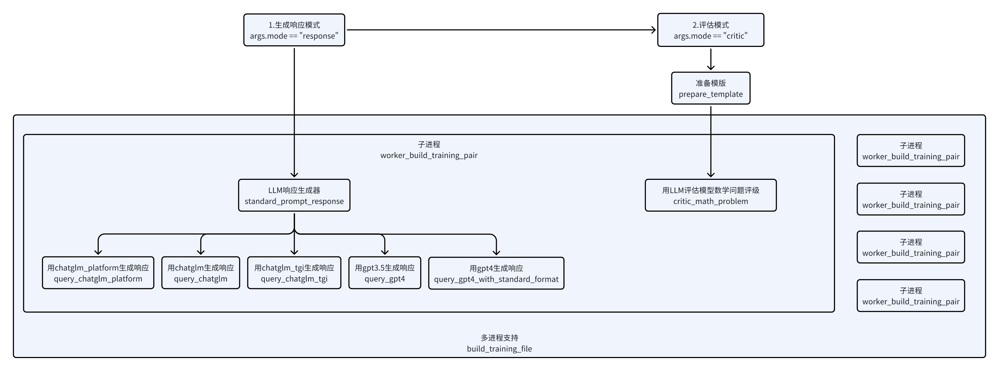
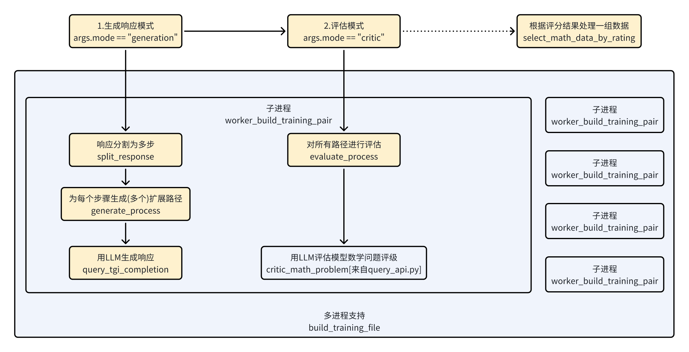

# math-feedback数学反馈

## 1.后向结果评分反馈

> 请关注文件：query_api.py

主要用于完成基本的数学问题响应与结果评估。

整个流程共分为两步：

1. 调用LLM针对数学问题生成对应的回复，这里会首先调用LLM相应生成器，它是对多个大模型接口的封装，可以选择多个支持的大模型进行响应生成
2. 对LLM的回复进行评估，这里主要是结果评估，也就是直接根据最终结果进行评估，会调用专家预设好的评估prompt完成评估。

## 2. 前向过程路径预测评分反馈

> 请关注文件：prm_evaluate_process.py

主要用于完成数学问题的响应分步，并针对分步骤的响应进行多路预测，并对各路预测进行细粒度评分。

建立在上述1.后向结果评估反馈后，整个流程共分为三步：

1. 针对数学问题之前的LLM响应，拆分成多步，并从每一步重新进行扩展步骤预测
2. 对所有预测的步骤进行评估
3. 统计所有的评估结果，获得整体评估
